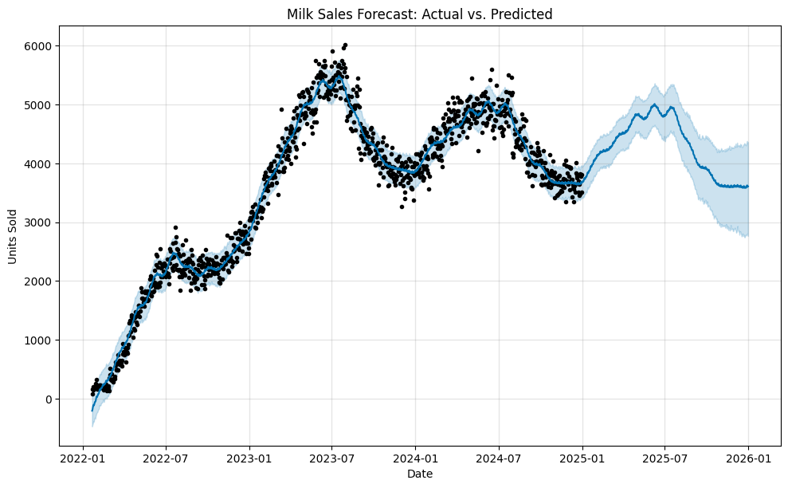

# Milk Sales Forecasting using Prophet



This repository contains a project that forecasts milk sales using the Prophet library. The notebook includes data analysis and visualization, as well as instructions for running the model.

## Installation

To install the required packages, run:

```bash
pip install -r requirements.txt
```

## Usage

1. Download the dataset.
2. Run the Jupyter Notebook to see the sales forecast.
3. Adjust parameters for better accuracy.

## Contributing

Feel free to submit issues or pull requests to improve the project!