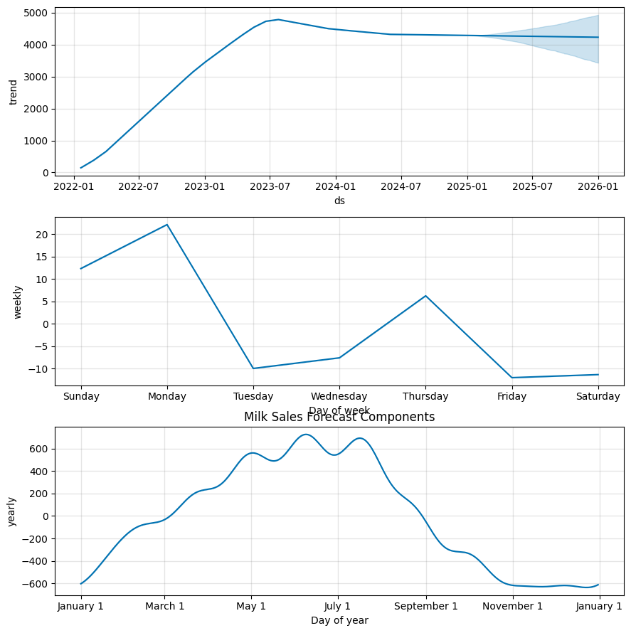

# 🥛 Milk Sales Forecasting using Prophet
 - A strategic time series forecasting project translating historical milk sales data into actionable inventory, supply chain, and demand planning decisions.
---
 
## 🛠️ Tech Stack
Python
pandas
matpotlib
Facebook Prophet
Google Colab

---

## 📌 Executive Summary
This project analyzes daily milk sales to forecast future demand and support operational decision-making.

## Key findings:

- Sales experienced rapid growth before stabilizing at a mature demand level.
- Peak demand occurs betwen May and July.
- Highest weekly demand occurs Mondays and Sundays.
- Forecast uncertainty increases further into the future, reinfocing the need for rolling forecasts.
- Thus analysis provides strategic guidance for inventory optimization, staffing allocation, and procurement planning.

---

## 🎯 Business Objective
The objective of this project is to:

- Forecast milk demand for 365 future days
- Identify weekly and yearly seasonality patterns
- Quantify demand uncertainity
- Reduce stockouts and overstocking risk
- Support data-driven supply chain decisions

--- 

## Repository Structure
[`milk_sales.csv`](milk_sales.csv) – Dataset containing daily milk sales (date, units_sold).

[`milk_sales_forecasting.ipynb`](milk_sales_forecasting.pynb) – Colab notebook with full preprocessing, modeling, evaluation, and visualization.
[`images/sales_forecast.png`](/sales_forecast.png)
[`images/components.png`](images/compnents)– Forecast and component visualizations

---
## 📊 Forecast visualization 

### Sales Forecast


### Forecast Components 


---

## How to Run
1. Open milk_sales_forecasting.ipynb in Google Colab or Jupyter Notebook.
2. Install required packages:
```bash
pip install pandas matplotlib prophet
```
3. Run all cells to:

- Preprocess data
- Train Prophet model
- Generate 365-day forecast
- Evaluate model perfomance
- Visualize forecast components


## Model Workflow
**Data Preprocessing:** Aggregated daily sales and renamed columns to ds (date) and y (units sold).

**Model Fitting:** Prophet model trained on historical data and automatically captured trend and seasonality

**Forecasting:** Predictions generated for 365 future days. Extracted prediction intervals

**Evaluation:** RMSLE calculated to measure performance. Achieved RMSLE ~ 0.4998

**Visualization:** Forecast and component plots show trends and seasonal patterns.

---

## 📊Key Analytical Findings

### 📈Trend Insight
- Sales grew significantly from 2022 to mid-2023.
- Demand then stabilized at approcimately 4500 units.
- Forecast indicates stable demand with mild growth.
- Strategic Interpretation: The business has likely reached a mature demand phase and should shift focus from ecpansion to operational efficiency.

### 🗓️ Weekly Seasonality Insight
Highest demand:
Monday
Sunday

Lowest demand:
Tuesday
Friday
Saturday

**Strategic Interpretation:** Demand peaks at the start of the week, suggesting grocery restocking behavior.

### 🗓️ Yearly Seasonality Insight
Peak months: May - July

Lowest months: October - December

**Strategic Interpretation:** Demand increases during winter months and declines toward year-end.

---

## Strategic Business Recommendations

### 📦 Inventory Optimization

- Increase stock allocation before peak months
- Align weekly replenishment cycles with Monday and Sunday demand spikes.


### 🏭 Production Planning
- Scale productions slightly ahead of forecasted peak periods.
- Avoid overproduction during low seasonal months.

### 👥 Staffing Strategy
- Allocate additional staff during high-demand weekdays.
- Optimize labor costs during lower-volume days.

### Risk Management
- Use prediction intervals to calculate safety stock levels.
- Avoid long-term overcommitment due to forecast updates.
- Consider adding external regressors (holidays, promotions, economic indicaors)

---

## Skills Demonstrated
- Time series forecasting with Python and Prophet
- Data preprocessing and cleaning
- Model evaluation (RMSLE)
- Trend and Seasonality Analysis
- Strategic business communication

  
## Project Value
This project demonstrates the ability to:

- Transform raw sales data into foward-looking insights
- Translates statistical outputs into business strategies
- Communicate technical finidings at executive level
- Support revenue and optimization and cost reductions

